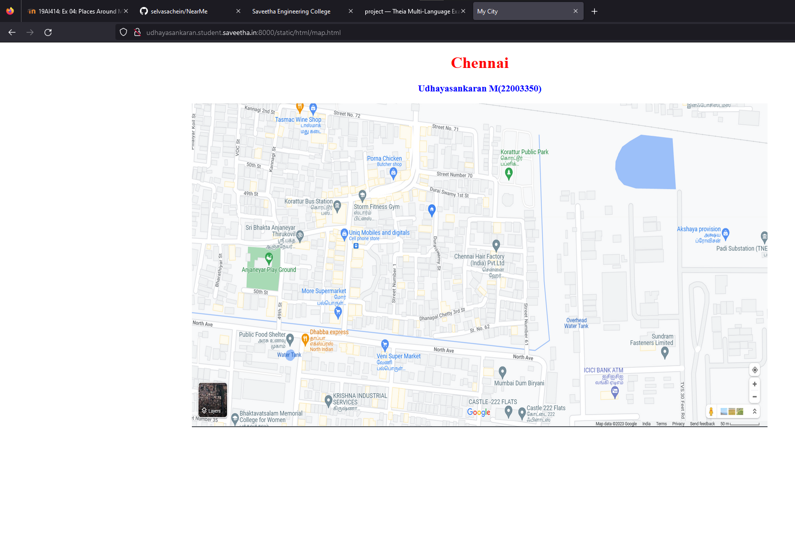
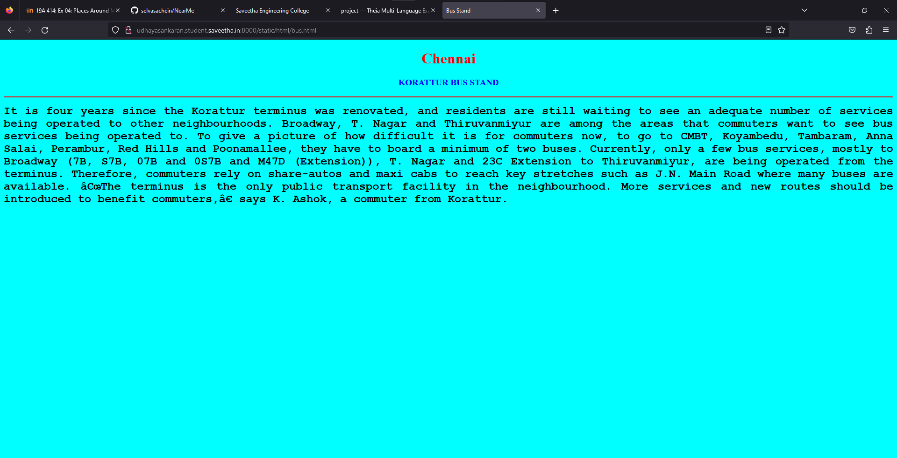
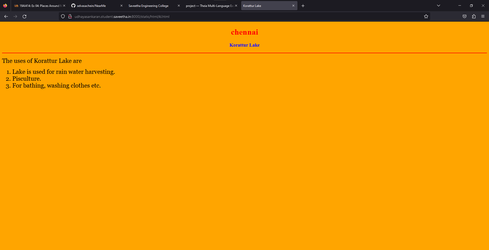
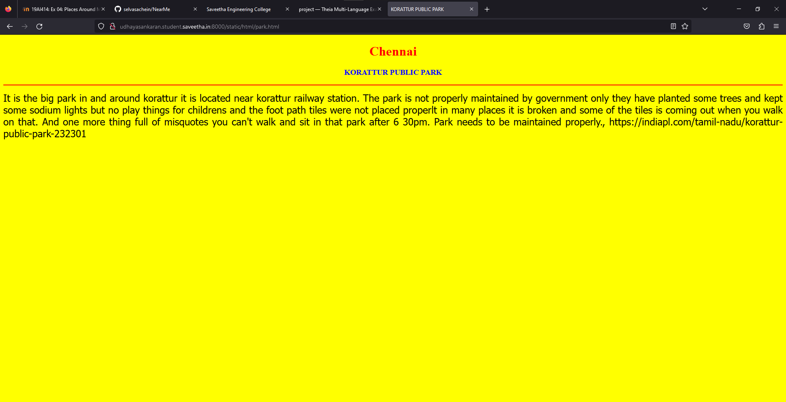
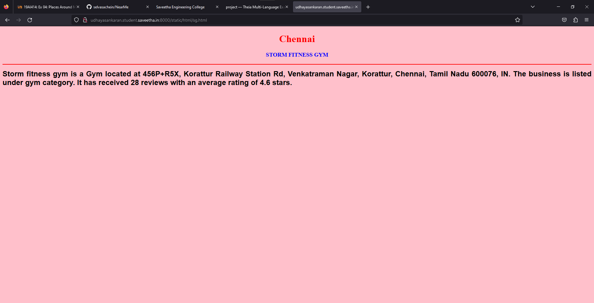
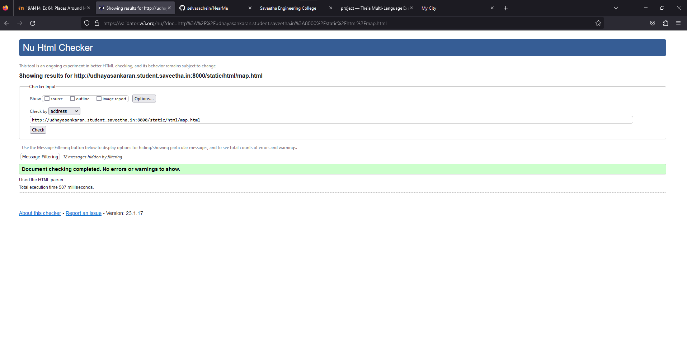

# Places Around Me
## AIM:
To develop a website to display details about the places around my house.

## Design Steps:

### Step 1:
clone the github repository into Theia IDE.

### Step 2:
create a new Django project

### Step 3:
Write the needed HTML code.

### Step 4:
Run the Django server and execute the HTML files.

## Code:
```
map.html

<!DOCTYPE html>
<html lang="en">
<head>
<title>My City</title>
</head>
<body>
<h1 align="center">
<font color="red"><b>Chennai</b></font>
</h1>
<h3 align="center">
<font color="blue"><b>Udhayasankaran M(22003350)</b></font>
</h3>
<center>

<map name="MyCity">
<area shape="circle" coords="1010,420,30" href="/static/html/KL.html" title=" Korattur Lake ">
<area shape="circle" coords="570,270,20" href="/static/html/sg.html" title="STORM FITNESS GYM">
<area shape="circle" coords="500,370,10" href="/static/html/ghs.html" title=" Government Higher Secondary School ">
<area shape="circle" coords="480,300,40" href="/static/html/bus.html" title="KORATTUR BUS STAND">
<area shape="circle" coords="1050,210,30" href="/static/html/park.html" title="KORATTUR PUBLIC PARK">
</map>
</center>
</body>
</html>

bus.html
<!DOCTYPE html>
<html lang="en">
<head>
<title>Bus Stand</title>
</head>
<body bgcolor="cyan">
<h1 align="center">
<font color="red"><b>Chennai</b></font>
</h1>
<h3 align="center">
<font color="blue"><b>KORATTUR BUS STAND</b></font>
</h3>
<hr size="3" color="red">
<p align="justify">
<font face="Courier New" size="5">
<b>
It is four years since the Korattur terminus was renovated, and residents are still waiting to see an adequate number of services being operated to other neighbourhoods. Broadway, T. Nagar and Thiruvanmiyur are among the areas that commuters want to see bus services being operated to. 
To give a picture of how difficult it is for commuters now, to go to CMBT, Koyambedu, Tambaram, Anna Salai, Perambur, Red Hills and Poonamallee, they have to board a minimum of two buses. 
Currently, only a few bus services, mostly to Broadway (7B, S7B, 07B and 0S7B and M47D (Extension)), T. Nagar and 23C Extension to Thiruvanmiyur, are being operated from the terminus. Therefore, commuters rely on share-autos and maxi cabs to reach key stretches such as J.N. Main Road where many buses are available. 
“The terminus is the only public transport facility in the neighbourhood. More services and new routes should be introduced to benefit commuters,” says K. Ashok, a commuter from Korattur.
</b>
</font>
</p>
</body>
</html>

park.html
<!DOCTYPE html>
<html lang="en">
<head>
<title>KORATTUR PUBLIC PARK</title>
</head>
<body bgcolor="yellow">
<h1 align="center">
<font color="red"><b>Chennai</b></font>
</h1>
<h3 align="center">
<font color="blue"><b>KORATTUR PUBLIC PARK</b></font>
</h3>
<hr size="3" color="red">
<p align="justify">
<font face="Tahoma" size="5">
It is the big park in and around korattur it is located near korattur railway station. The park is not properly maintained by government only they have planted some trees and kept some sodium lights but no play things for childrens and the foot path tiles were not placed properlt in many places it is broken and some of the tiles is coming out when you walk on that. And one more thing full of misquotes you can't walk and sit in that park after 6 30pm. Park needs to be maintained properly., https://indiapl.com/tamil-nadu/korattur-public-park-232301
</font>
</p>
</body>
</html>

ghs.html
<!DOCTYPE html>
<html lang="en">
<head>
<title> Government Higher Secondary School </title>
</head>
<body bgcolor="lime">
<h1 align="center">
<font color="red"><b>Chennai</b></font>
</h1>
<h3 align="center">
<font color="blue"><b> Government Higher Secondary School </b></font>
</h3>
<hr size="3" color="red">
<p align="justify">
<font face="Georgia" size="5">
The main objectives of korattur Government Higher Secondary School are 
<ul>
<li>To impart proper and qualified training to teachers and give them an attractive salary and incentives so that they are not tempted to quit and look elsewhere for jobs.</li>
<li>To provide financial aids and grants wisely and judiciously.</li>
<li>To Frame of syllabus and curriculum.</li>
<li>To set aims and objectives of education.</li>
</ul>
</font>
</p>
</body>
</html>

kl.html
<!DOCTYPE html>
<html lang="en">
<head>
<title> Korattur Lake </title>
</head>
<body bgcolor="orange">
<h1 align="center">
<font color="red"><b>chennai </b></font>
</h1>
<h3 align="center">
<font color="blue"><b>Korattur Lake </b></font>
</h3>
<hr size="3" color="red">
<p align="justify">
<font face="Georgia" size="5">
The uses of Korattur Lake are 
<ol type="1">
<li>Lake is used for rain water harvesting.</li>
<li>Pisculture.</li>
<li>For bathing, washing clothes etc.</li>
</ol>
</font>
</p>
</body>
</html>

sg.html
<!DOCTYPE html>
<html lang="en">
<head>
<title></title>
</head>
<body bgcolor="pink">
<h1 align="center">
<font color="red"><b>Chennai</b></font>
</h1>
<h3 align="center">
<font color="blue"><b>STORM FITNESS GYM</b></font>
</h3>
<hr size="3" color="red">
<p align="justify">
<font face="Arial" size="5">
<b>
Storm fitness gym is a Gym located at 456P+R5X, Korattur Railway Station Rd, Venkatraman Nagar, Korattur, Chennai, Tamil Nadu  600076, IN.
The business is listed under gym category. It has received 28 reviews with an average rating of 4.6 stars.
</b>
</font>
</p>
</body>
</htmlś>
```


## Output:











## HTML validator


## Result:
The program for implementing image map is executed successfully 